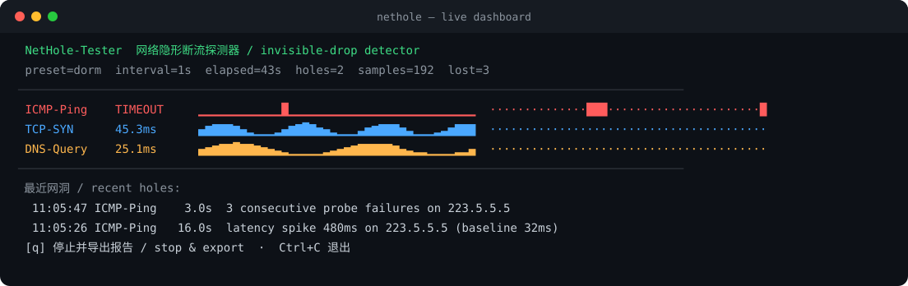
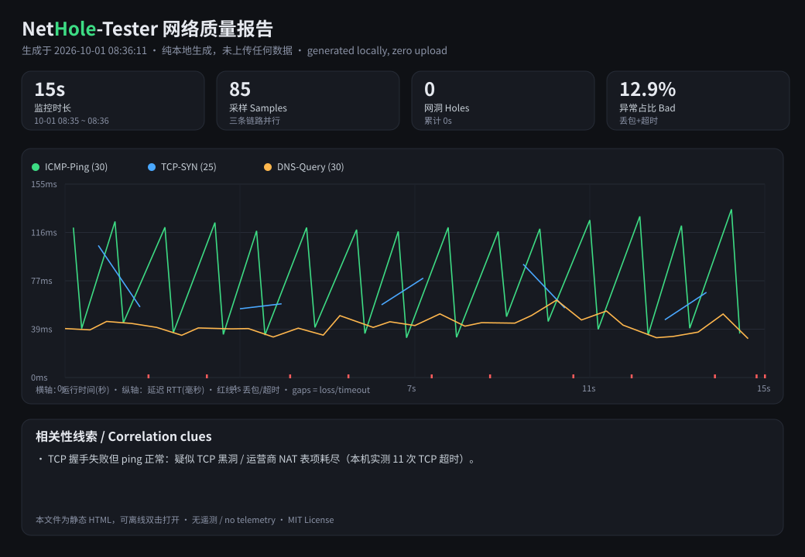
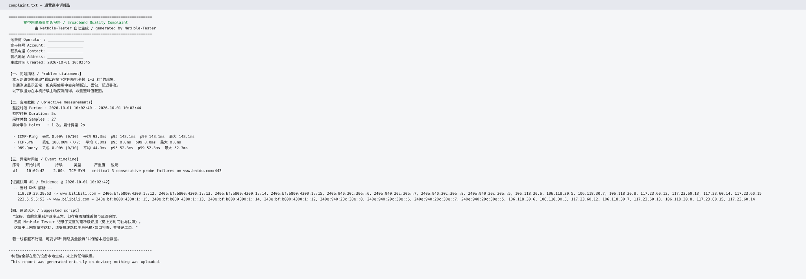

<div align="center">

```
 _   _      _   _       _        _____         _
| \ | | ___| |_| |__   | | ___  |_   _|__  ___| |_ ___ _ __
|  \| |/ _ \ __| '_ \  | |/ _ \   | |/ _ \/ __| __/ _ \ '__|
| |\  |  __/ |_| | | | | |  __/   | |  __/\__ \ ||  __/ |
|_| \_|\___|\__|_| |_| |_|\___|   |_|\___||___/\__\___|_|
```

**抓住那些「网没断，但就是卡」的瞬间。**
**Catch the invisible outages your ISP swears don't exist.**

[](https://go.dev)
[](LICENSE)
[](#安装--install)
[](#-隐私铁则--privacy)
[](CONTRIBUTING.md)
[](#)

</div>

---

> **NetHole-Tester** 是一个纯 Go 编写的轻量网络诊断工具，用**毫秒级**并行探测
> （ICMP + TCP-SYN + DNS）自动抓出**间歇性隐形断流 / 丢包突发 / 延迟突跳 / TCP 黑洞**，
> 在异常发生的**瞬间自动保存证据**（traceroute、DNS、ARP、Wi-Fi 信号），
> 并一键生成**运营商申诉报告**和**可交互离线 HTML 报告**。
>
> 零依赖、零遥测、零上传。树莓派 / Termux 上 7×24 挂着也几乎不耗资源。
>
> **NetHole-Tester** is a dependency-free Go tool that catches intermittent packet
> loss, latency spikes and TCP blackholes, snapshots the evidence the moment they
> happen, and produces an ISP complaint report + an offline interactive HTML report.
> **No telemetry, no upload, no LLM, no runtime.**

<div align="center">



</div>

---

## 目录 · Table of Contents

- [为什么需要它 · Why](#为什么需要它--why)
- [能解决 / 不能解决 · Scope](#能解决什么--不能解决什么--scope)
- [核心特性 · Features](#核心特性--features)
- [30 秒安装 · Install](#安装--install)
- [快速开始 · Quick start](#快速开始--quick-start)
- [三套预设 · Presets](#三套预设--presets)
- [结果怎么看 · Reading results](#结果怎么看--reading-results)
- [输出文件 · Outputs](#输出文件--outputs)
- [隐私铁则 · Privacy](#-隐私铁则--privacy)
- [安全与合规 · Safe use](#-安全与合规使用--safe-compliant-use)
- [架构 / 目录结构 · Architecture](#架构--目录结构--architecture)
- [从源码构建 · Build](#从源码构建--build-from-source)
- [截图 · Screenshots](#截图--screenshots)
- [FAQ](#faq)
- [贡献 · Contributing](#贡献--contributing)

---

## 为什么需要它 · Why

你可能遇到过这些情况：

- 打游戏 / 开视频会议时**随机卡 1~3 秒**，过一会儿又好了；
- 下载大文件时速度正常，但网页**偶尔转圈**；
- 客服让你测速，测速网站显示「500Mbps，一切正常」；
- 重启光猫当天有效，第二天又犯；
- 室友 / 邻居 / 运营商都说「不是我们的问题」。

**问题在于：普通 `ping` 和测速只是「快照」，看不出间歇性故障。**
故障持续时间极短、随机出现，等你打开工具时它已经消失了。
没有证据，就没法投诉，也没法定位。

NetHole-Tester 的设计目标只有一个：
**在你不在场的时候，替你 7×24 盯着网，把每一次异常连同现场证据一起记下来。**

> The problem: ordinary ping/speed-tests are snapshots and miss short, random
> outages. Without evidence you cannot prove anything to your ISP. NetHole-Tester
> watches continuously and captures the scene of the crime.

---

## 能解决什么 / 不能解决什么 · Scope

### ✅ 能解决 · What it DOES

| 场景 | 如何发现 |
|---|---|
| 间歇性隐形断流 | 三条链路并行 + 连续丢包阈值，命中即记事件 |
| 延迟突跳 / 抖动 | 滚动基线 + 突跳阈值（默认 +200ms） |
| TCP 黑洞 | TCP 三次握手超时单独判定（ping 正常但 TCP 不通） |
| DNS 偷包 / 解析异常 | 直连指定 DNS 服务器、逐次计时、校验事务 ID |
| Wi-Fi 漫游闪断 | 事件前后 Wi-Fi 信号 + 周期性规律提示 |
| 光猫端口缓冲卡死 / bufferbloat | p95/p99 尾部延迟 + 相关性提示 |
| 拿不出证据 | 自动快照 + 申诉报告，可直接截图给运营商 |

### ❌ 明确不做 · What it does **NOT** do

- ❌ **不是测速工具**，不测带宽峰值；它测的是「稳定性」。
- ❌ **不做 VPN / 代理 / 抓包劫持 / 深度包解析**。
- ❌ **不破解、不攻击、不压测**；发包频率默认非常保守。
- ❌ **不能 100% 诊断**故障原因；它提供**证据**和**相关性线索**，不替你下最终结论。
- ❌ **不保证在所有环境能读信噪比**（Android 权限限制下 Wi-Fi 信号可能读不到，会如实标注）。

---

## 核心特性 · Features

- ⏱ **三链路并行高精度探测**：ICMP / TCP-SYN(80,443) / DNS 递归，毫秒级时间戳。
- 🕳 **自动识别网洞**：可自定义阈值——延迟突跳、连续丢包、TCP 握手超时。
- 📸 **事件触发自动快照**：命中瞬间保存 traceroute/mtr、DNS 结果、ARP 表、Wi-Fi 信号。
- 📊 **本地分析器**：完全离线，输出可读文本、ASCII 趋势图、Excel 友好的 CSV。
- 📄 **一键申诉报告**：预排版文案 + 时间轴 + 证据，直接截图找客服。
- 🌐 **离线交互 HTML 报告**：单个静态文件，浏览器打开即有可交互延迟曲线。
- 🍓 **长时后台模式**：树莓派 / Termux 挂机，低 CPU、自动日志轮转，不会写爆存储。
- 🎛 **三套预设** + 新手快速模式（按 `1` 直接开测）。
- 🔒 **零遥测**：代码中没有任何上传/回传逻辑，数据只落在你自己的磁盘上。
- 🧱 **单静态二进制**：Linux-amd64 / ARM64 / ARMv7 / Windows / macOS，无运行时依赖。

---

## 安装 · Install

> 所有平台的安装方式都是「下载一个文件 → 加执行权限 → 运行」。
> 没有 Python、没有 Node、没有 Docker、没有外部运行时。

### 🟢 Termux (Android)

```bash
# 方式一：用 Termux 自带 Go 编译（推荐，最稳）
pkg install -y golang git make
git clone https://github.com/wangzi5151/nethole-tester
cd nethole-tester && make build
./bin/nethole

# 方式二：直接下载预编译（linux-arm64 同样能在 Termux 跑）
curl -L https://github.com/wangzi5151/nethole-tester/releases/latest/download/nethole-linux-arm64 \
  -o nethole && chmod +x nethole && ./nethole
```

### 🍓 Raspberry Pi (树莓派)

```bash
# 64 位系统（Pi 3/4/5 推荐）
curl -L https://github.com/wangzi5151/nethole-tester/releases/latest/download/nethole-linux-arm64 \
  -o nethole && chmod +x nethole

# 32 位系统（老款 Pi Zero / Pi 2）
curl -L https://github.com/wangzi5151/nethole-tester/releases/latest/download/nethole-linux-arm-v7 \
  -o nethole && chmod +x nethole

sudo mv nethole /usr/local/bin/
```

### 🪟 Windows

```powershell
# PowerShell
Invoke-WebRequest -Uri https://github.com/wangzi5151/nethole-tester/releases/latest/download/nethole-windows-amd64.exe -OutFile nethole.exe
.\nethole.exe
```

### 🐧 Linux (x86_64) / 🍎 macOS

```bash
# Linux
curl -L https://github.com/wangzi5151/nethole-tester/releases/latest/download/nethole-linux-amd64 \
  -o nethole && chmod +x nethole && ./nethole

# macOS (Apple Silicon)
curl -L https://github.com/wangzi5151/nethole-tester/releases/latest/download/nethole-darwin-arm64 \
  -o nethole && chmod +x nethole && ./nethole
```

---

## 快速开始 · Quick start

### 新手模式（不需要记任何参数）

```bash
./nethole
```

会出现菜单，**输入 `1` 回车**即可开始测宿舍宽带（默认 10 分钟）：

```
  ┌──────────────────────────────────────────────┐
  │        NetHole-Tester  新手快速模式          │
  │   网络“没断但随机卡”? 现在开始抓证据。       │
  └──────────────────────────────────────────────┘
    1) 宿舍宽带模式    (推荐先测 10 分钟)
    2) 手机 4G/5G 模式 (测 5 分钟)
    3) 树莓派 7x24 监控 (后台长测 1 小时)
    0) 自定义参数
  输入数字后回车 (直接回车 = 1):
```

### 命令行模式

```bash
# 测 30 分钟，宿舍模式
./nethole run --preset=dorm --duration=30m

# 树莓派后台 7x24（无界面，日志自动轮转）
./nethole run --preset=pi24x7 --headless --out=/var/log/nethole

# 从日志重新生成/导出报告
./nethole report --in=/var/log/nethole --complaint
```

运行中按 `q` 可随时停止，并**自动生成全部报告**。

---

## 三套预设 · Presets

| 预设 | 间隔 | 适用 | 特点 |
|---|---|---|---|
| `dorm` 宿舍宽带 | 1s | 校园网 / 租房共享宽带 | 对 1~3 秒卡顿敏感，抓 bufferbloat |
| `mobile5g` 移动网络 | 1s | 4G/5G 热点 | 容忍移动网络天然抖动，只抓硬故障 |
| `pi24x7` 树莓派监控 | 3s | 7×24 长期挂机 | 极低负载，4MB×8 自动轮转 |

```bash
./nethole run --preset=dorm --spike-ms=150 --loss-burst=2   # 更敏感的自定义阈值
```

---

## 结果怎么看 · Reading results

终端里会同时给出**实时界面**和**结束后的分析**：

```
[ICMP-Ping]  1.1.1.1, 223.5.5.5
  包 Packets : 3000 ok / 6 lost  (0.20% loss)
  延迟 RTT ms: min 31.8  avg 79.8  p50 116.7  p95 128.8  p99 134.5  max 640.2
  趋势 Trend : ▁▁▁▁▁▂▆▆▆▇▇█▇▆▅▁▁▁▁▁▂▆▆
  丢包 Loss  : ······················█·············
```

怎么读：

- **趋势 Trend**：每个字符是一段时间的延迟快照，越右边越高。突然冒高再回落 = 延迟突跳。
- **丢包 Loss**：`·` 正常，`░▒▓█` 丢失密度；出现连续的 `█` 就是断流。
- **p95 / p99**：尾部延迟。平均值正常但 p99 很高 = 典型的「偶尔卡一下」。
- **网洞事件**：达到阈值的那一刻被记录，含时长、类型、严重度和原因。

**看到 `ICMP 正常但 TCP 全红`？** 这往往不是断网，而是运营商对该 IP/端口做了限制或 NAT 问题——
工具会在「相关性线索」里提示你，但**不会替你下绝对结论**。

> Interpreting output: use the trend line for latency, the loss strip for drops,
> p95/p99 for tail latency, and the hole events for hard evidence.

---

## 输出文件 · Outputs

运行结束后，输出目录（默认 `./nethole-out/`）里会有：

| 文件 | 说明 |
|---|---|
| `report.html` | **离线交互报告**，双击用浏览器打开，有可交互延迟曲线 |
| `complaint.txt` | **运营商申诉报告**，预排版，可直接截图 |
| `samples.csv` | 全部原始样本（带 UTF-8 BOM，Excel 直接打开不乱码） |
| `events.csv` | 网洞事件清单 |
| `samples.jsonl` | 原始样本日志（每行一个 JSON，供二次分析） |
| `events.jsonl` | 事件日志（含事件快照证据） |

重新导出（不改动原始日志）：

```bash
./nethole report --in=./nethole-out \
  --operator="中国电信" --account="你的宽带账号" \
  --contact="你的电话" --location="装机地址"
```

---

## 🔒 隐私铁则 · Privacy

这是本项目的核心原则之一，也是我们最在意的部分：

- **零遥测（Zero Telemetry）**：没有 Google Analytics、没有 Sentry、没有版本检查、没有任何 `POST` 回传。
- **无隐藏网络行为**：程序**只会**发送你配置的 ICMP / TCP-SYN / DNS 探测包。
- **数据只在你本地**：所有结果写入你指定的本地目录，分析全部本地完成。
- **可审计**：代码完全开源，你可以 `grep` 全仓库确认没有任何上传逻辑：

```bash
# 自己验证一下，应该什么也搜不到（除了你配置的探测目标）
grep -rniE "http://|https://|analytics|telemetry|upload" --include=*.go ./internal ./cmd
```

> **Zero telemetry, no uploads, no callbacks.** The only network traffic is the
> probes you explicitly configure. Verify it yourself with the `grep` above.

---

## 安全与合规使用 · Safe & compliant use

请务必遵守：

- ⚠️ **不要**用它做压力测试 / 泛洪 / 打公网 IP。默认间隔 ≥ 1s，且程序强制最小 200ms。
- ⚠️ **只探测**你有权使用的网络与目标；探测前确认不违反当地法律与运营商条款。
- ⚠️ ICMP 在部分网络被限速是正常的，**不要**据此认定断网（工具会提示）。
- ⚠️ 长测会产生日志，虽然自动轮转，仍请留意磁盘空间。
- ⚠️ 本工具**仅供网络质量观测与维权取证**，不提供任何攻击能力。

> Please do not abuse this tool for stress-testing or flooding. Probe only networks
> you are authorized to use. Rate limits are deliberately conservative.

---

## 架构 / 目录结构 · Architecture

```
nethole-tester/
├── cmd/nethole/main.go        CLI 入口：quick/run/report/version，串起整条流水线
├── internal/
│   ├── model/                 共享数据模型（Sample / HoleEvent / Snapshot）
│   ├── config/                配置 + 三套预设 + 阈值校验
│   ├── probe/                 三链路探测：icmp.go / tcp.go / dns.go / runner.go
│   ├── detect/                网洞检测器（丢包突发 / 延迟突跳 / 超时）
│   ├── snapshot/              事件快照：traceroute / arp / dns / wifi / tools.go
│   ├── storage/               JSONL 日志 + 按大小轮转
│   ├── analyze/               统计 / ASCII 图 / CSV / 相关性线索
│   ├── report/                申诉报告 + 离线交互 HTML
│   └── ui/                    bubbletea 实时终端界面
├── Makefile                   一键构建 + 交叉编译 + 校验和
├── .github/                   Issue 模板 + Release CI
└── docs/assets/               截图 (SVG) / LOGO / 素材说明
```

数据流：

```
 probers(3链) ──► Runner ──► Engine ─┬─► storage(JSONL, 轮转)
                                     ├─► detector ──► snapshot(证据)
                                     └─► UI frames(非阻塞, 掉帧不丢数据)
                                              │
                                     退出时 ──► analyze ──► report(txt/html/csv/申诉)
```

设计要点：
- 每条链路一个独立 goroutine + 独立超时，**一条卡不会拖累其他链路**。
- Engine 是样本流的唯一消费者，UI 用非阻塞发送，**界面卡顿绝不丢数据**。
- 快照在**后台**抓取，并用信号量限制并发，**不阻塞探测**。

---

## 从源码构建 · Build from source

需要 Go 1.23+（普通用户无需安装 Go，直接下载下面的预编译二进制即可）。

```bash
git clone https://github.com/wangzi5151/nethole-tester
cd nethole-tester

make build          # 本机二进制 -> bin/nethole
make test           # 单元测试（不联网）
make dist           # 交叉编译全部平台 -> dist/ + SHA256SUMS
```

国内网络如果 `go mod tidy` 慢，可设代理：

```bash
export GOPROXY=https://goproxy.cn,direct
```

交叉编译目标（`make dist` 自动完成）：

| 平台 | 文件 |
|---|---|
| Linux x86_64 | `nethole-linux-amd64` |
| Linux ARM64（Pi 3/4/5、Termux） | `nethole-linux-arm64` |
| Linux ARMv7（老款 Pi） | `nethole-linux-arm-v7` |
| macOS Intel / Apple Silicon | `nethole-darwin-amd64` / `nethole-darwin-arm64` |
| Windows | `nethole-windows-amd64.exe` |

---

## 截图 · Screenshots

> 以下截图由工具**真实输出**渲染生成（`internal/ui` 白盒渲染 + 真实探测数据），
> 非手绘示意图。SVG 格式在 GitHub / 浏览器中按本机字体渲染，中文显示正常。

**实时终端面板 · live TUI dashboard**


**离线交互 HTML 报告 · offline interactive report**（延迟曲线 + 丢包标记 + 相关性线索）



**运营商申诉报告 · carrier complaint report**



> 想贡献 GIF 录屏？参考 [docs/assets/README.md](docs/assets/README.md) 的 `asciinema` / `agg` 用法。

---

## FAQ

**Q: 为什么普通 ping 测不出来？**
A: ping 是单点快照。故障是随机的、短暂的，你在打开 ping 的那一刻它可能已经恢复了。
NetHole-Tester 用三条链路持续采样并长期留存。

**Q: 会不会上传我的数据？**
A: 不会。见 [隐私铁则](#-隐私铁则--privacy)，你可以自己 grep 源码验证。

**Q: 为什么 ICMP 丢包但网页正常？**
A: 很多运营商对 ICMP 限速。工具会提示你这是「ICMP 被限速，非真实断网」。

**Q: Termux 上 Wi-Fi 信号读不到？**
A: Android 权限限制，非 root 下经常读不到。工具会如实标注「不可用」，不影响其他功能。

**Q: 会不会太耗资源？**
A: 默认每条链路 1 次/秒，树莓派预设 3 秒一次；探测为事件驱动、无忙轮询，实际占用很低（可用 `top` 自行确认）。我们不做未经验证的数字承诺。

**Q: 能把报告发给运营商吗？**
A: 可以，`complaint.txt` 就是为此设计的，直接截图或复制即可。

---

## 贡献 · Contributing

欢迎 Issue / PR！请先阅读 [CONTRIBUTING.md](CONTRIBUTING.md)。
特别欢迎：更多平台的快照采集器、新的检测规则、更好的报告模板。

使用 [Bug Report](.github/ISSUE_TEMPLATE/bug_report.md) /
[Feature Request](.github/ISSUE_TEMPLATE/feature_request.md) 模板提交。

---

## License

[MIT](LICENSE) © NetHole-Tester contributors

<div align="center">
<sub>Made with ❤️ for 学生、宿舍党、租房党、树莓派玩家、以及所有被“网没问题”气到的人。</sub>
</div>
